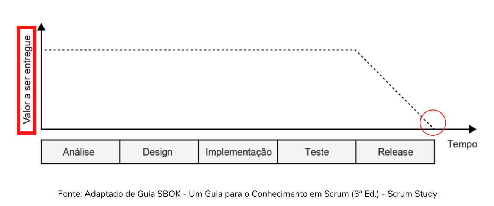
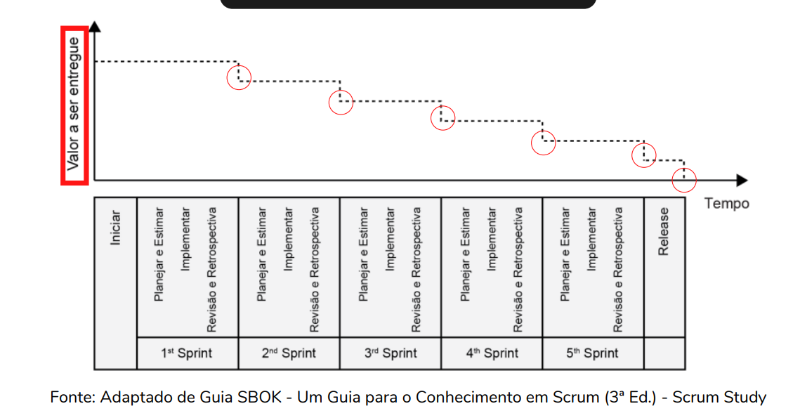
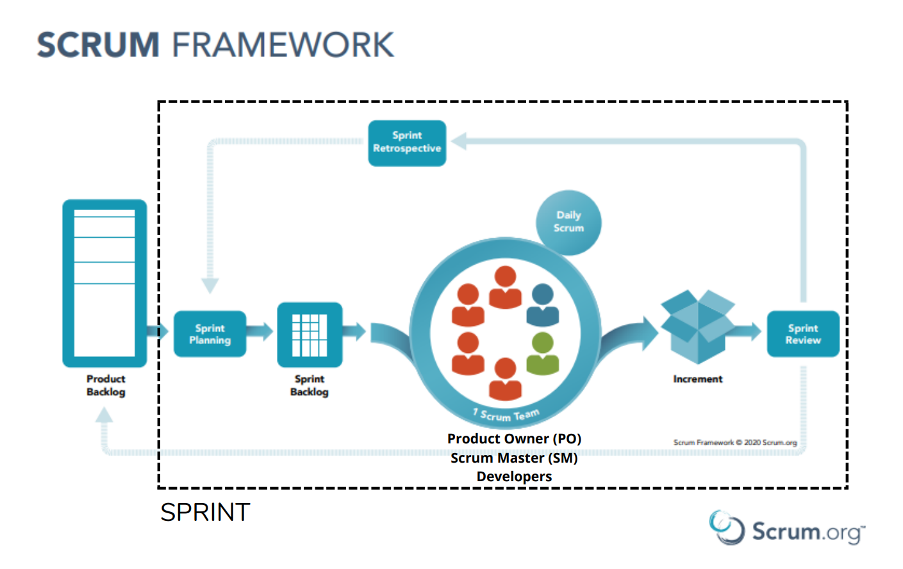
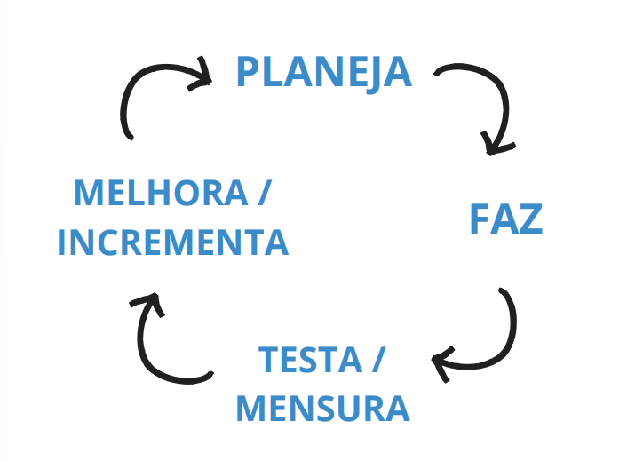
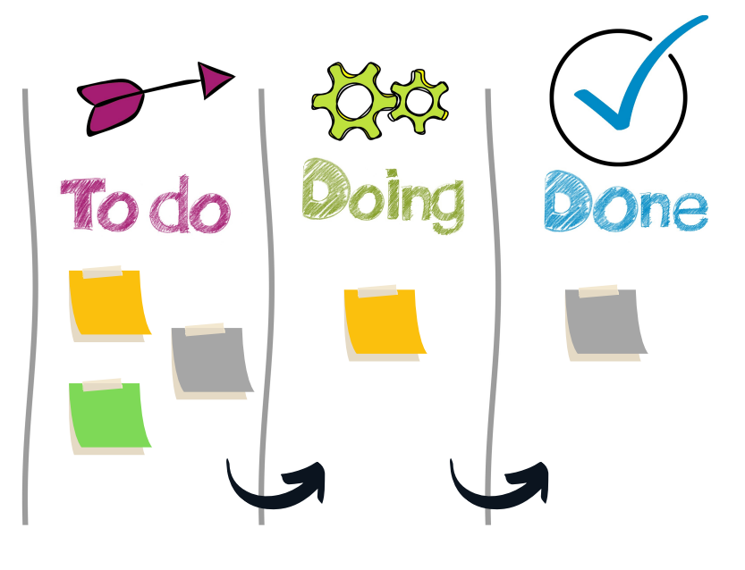

[Voltar](./README.md)

# Trabalhando em Equipes Ágeis

> Curso administrado por [Leonardo Ropelato](https://www.linkedin.com/in/leonardo-ropelato/).

---

## :receipt:  Sumário

1. [Introdução a Cultura Ágil](#intro)
2. [Gerenciamento de Projetos e Gestão Ágil](#gerenciamento)
3. [Métodos e Ferramentas Ágeis](#metodos)

---

## 1. Introdução a Cultura Ágil 

### 1.1. Agilidade x Rapidez

1. Ser ágil não quer dizer necessariamente ser mais rápido;
2. Ser ágil é ter facilidade no aprendizado e adaptação;
3. Ter um time veloz, correndo contra o tempo é ter:
    - Um time estressado;
    - Que entrega de qualquer jeito;
    - Comunicação ruim;
    - Muitos conflitos;
4. Ter um time ágil é ter:
    - Ser eficiente;
    - Ter metas previstas, discutidas e calculadas;
    - Trabalha em conjunto, com comunicação acertiva;
    - Fluxo de tarefas, do que deve ser feito, como deve ser feito;
    - Ser ágil (validar se caminho até a entrega está certo).

### 1.2. Os Valores do Manifesto Ágil

- O documento foi criado em fevereiro de 2001, quando 17 profissionais, que já praticavam métodos ágeis como XP, DSDM, Scrum, FDD etc, se reuniram.
- Embora esses 17 desenvolvedores utilizassem abordagens e métodos diferentes, eles compartilhavam dos mesmos fundamentos.
- Foram materializados 4 valores e 12 princípios

### 1.3. Valores

1. **Indivíduos e Interações**, mais que processos e ferramentas;
2. **Software em funcionamento**, mais que documentação abrangente;
3. **Responder a mudanças**, mais que seguir um plano;
4. **Colaboração com o cliente**, mais que negociação de contratos.

### 1.4. Princípios

1. Nossa maior prioridade é satisfazer o cliente através da entrega contínua e adiantada de software com valor agregado;
2. Aceitar mudanças de requisitos, mesmo no fim do desenvolvimento. Processos ágeis se adequam a mudanças, para que o cliente possa tirar vantagens competitivas;
3. Entregar frequentemente software funcionando, de poucas semanas a poucos meses, com preferência à menor escala de tempo;
4. Pessoas de negócio e desenvolvedores devem trabalhar diariamente em conjunto por todo o projeto;
5. Construir projetos em torno de indivíduos motivados, dando a eles o ambiente e o suporte necessário e confiando neles para fazer o trabalho;
6. O método mais eficiente e eficaz de transmitir informações para e entre uma equipe de desenvolvimento é por meio de conversa face a face;
7. Software funcionando é a medida primária de progresso;
8. Os processos ágeis promovem desenvolvimento sustentável. Os patrocinadores, desenvolvedores e usuários devem ser capazes de manter um ritmo constante indefinidamente;
9. Contínua atenção a excelência técnica e bom design aumenta a agilidade;
10. Simplicidade: a arte de maximizar a quantidade de trabalho não realizado é essencial;
11. As melhores arquiteturas, requisitos e designs emergem de times auto-organizáveis;
12. Em intervalos regulares, a equipe reflete sobre como se tornar mais eficaz e então refina e ajusta seu comportamento de acordo.

### 1.5. Características de um time ágil

- Alinhado com o cliente e stakeholders;
- Auto-organizado e Responsável;
- Multidisciplinar;
- Entrega valor continuamente;
- Está sempre aprendendo;
- Melhoria contínua;
- Possui métricas e metas claras;
- Unido.

### 1.6. Importância da agilidade no mundo de tecnologia

- Inovação;
- Entregas rápidas;
- Eficiência.

#### A gente vive no mundo VUCA

    V. Volatility - volátil;
    U. Uncertainty - incerto;
    C. Complexity - complexo;
    A. Ambiguity - ambíguo.

---

 

## 2. Gerenciamento de Projetos e Gestão Ágil 

### 2.1 Projeto x Processo

#### PROCESSO

- É recorrente e contínuo;
- É replicável;
- Geralmente é repetitivo e realizado regularmente.

> Exemplo: Processo de solicitação de compra em uma empresa.
> Você solicita ao responsável do setor de compras a compra de um notebook, ele faz os orçamentos, o gestor/diretor aprova a compra e ele realiza o pedido.

#### PROJETO

- Um esforço temporário para atingir um objetivo;
- O resultado é exclusivo;
- Tem início e fim bem definidos.

> Exemplo: Projeto de desenvolvimento de um novo modelo de fones de ouvido de uma marca.
> Esse projeto iniciará com o objetivo de criar um modelo de fone de ouvido e passará pelas fases do projeto até a entrega do produto, o novo fone.

### 2.2. Ágil x Tradicional

#### MODELO TRADICIONAL CASCATA (WATERFALL)

1. Análise
2. Projeto (design)
3. Implementação
4. Teste
5. Entrega/Manutenção

#### Gráfico Waterfall:

 

#### Gráfico Scrum:

 

#### Diferenças entre Cascata e Scrum:

**CASCATA**:

- Planejamento inicial:
    - Escopo;
    - Custo;
    - Cronograma;
- Valor entregue no final.

**SCRUM**:
- Planejamento por Sprints;
- Desenvolvimento iterativo e incremental;
- Valor entregue continuamente(FEEDBACK).

### 2.3. O que é Gestão Ágil ?

#### Uma forma de gestão que seja:

- Flexível e que se adapte às mudanças;
- Colaborativa e que gere transparência;
- Voltada ao aprendizado;
- Entrega Contínua de Valor.

---

 

## 3. Métodos e Ferramentas Ágeis 

### 3.1 Métodos Ágeis

- Framework Scrum;
- Extreme Programming (XP);
- Kanban;
- OKR.

### 3.2. Scrum

> "Scrum é um framework leve que ajuda pessoas, times e organizações a gerar valor por meio de soluções adaptativas para problemas complexos.", Scrum Guide (Nov. 2020).

#### As bases do Scrum

- Empirismo:
    - Tomar decisões com base no que é observado e aprendido.
- Lean Thinking:
    - Uma forma de pensar a gestão e os processos da empresa. A mentalidade proposta é a de melhoria contínua de processos, a partir dos princípios do Lean thinking que incluem foco em melhorar as entregas, utilizando menos recursos e priorizando apenas o que é visto como valor pelo cliente.

#### Pilares do Scrum

- TRANSPARÊNCIA
    - A transparência permite que todos os ângulos de qualquer processo Scrum sejam observados por qualquer pessoa. Isto promove um fluxo de informação fácil e transparente em toda a organização e cria uma cultura de trabalho aberta.
- INSPEÇÃO
    - A inspeção é a arte de pensar, no sentido de aplicar uma visão crítica sobre o que está acontecendo. É detectar variações ou problemas potencialmente indesejáveis.
        - Olhando e medindo o progresso do time;
        - Feedback dos clientes e stakeholders;
        - Inspeção e aprovação das entregas.
- ADAPTAÇÃO
    - A adaptação acontece quando o Time Scrum aprende através da transparência e da inspeção e, em seguida, adaptam o processo ao fazerem melhorias no trabalho que está sendo realizado, evitando, também, novos desvios.

#### Framework ou Metodologia ágil?

- O framework Scrum é propositalmente incompleto, apenas definindo as partes necessárias para implementar a teoria Scrum.
- Em vez de fornecer às pessoas instruções detalhadas, as regras do Guia do Scrum orientam seus relacionamentos e interações.

 

### 3.3. Extreme Programming (XP)

- Extreme Programming (XP) é um método ágil criado no final da década de 90 para desenvolvimento de software.
- É uma metodologia que tem como objetivo criar sistemas com alta qualidade, com base em uma interação próxima com os clientes, testagem constante e ciclos de desenvolvimento curtos.
- Objetivo principal: fazer ciclos de entregas rápidos, contínuos e incrementais, para atingir os resultados esperados pelo cliente.

#### O QUE TEM NO XP?

- CICLOS
- "CERIMÔNIAS"
- TESTES
- PROGRAMAÇÃO EM PARES
- FEEDBACK
- APROXIMAÇÃO COM O CLIENTE
- FLEXIBILIDADE

 

### 3.4. Kanban

- É um método para definir, gerenciar e melhorar serviços que entregam trabalho de conhecimento, como serviços profissionais, atividades criativas e o design de produtos físicos e de software.
- A simplicidade e os benefícios que o método proporciona,faz dele um dos mais utilizados em empresas de todos os segmentos.

#### História

- Com o intuito de equilibrar a sua produção para evitar essas duas situações, a Toyota (fabricante de automóveis) desenvolveu o método kanban na década de 1940, que foi englobado como uma parte do Sistema Toyota de Produção.
- Princípio Lean: o seu objetivo era promover o controle do estoque de materiais para que os produtos não excedessem e nem faltassem, trazendo equilíbrio para o seu estoque e linha de produção.

#### Kanban hoje

- Na atualidade, o quadro kanban ultrapassou os limites da indústria e passou a ser utilizado em diferentes áreas, como:
    - Em equipes de marketing;
    - Prestação de serviços;
    - Desenvolvimento de softwares.
- Funcionando como uma ferramenta de GESTÃO DE TAREFAS.

#### O quadro Kanban

 

#### Curiosidade

- Kanban = Método
- A palavra japonesa "kanban" significa: "sinal", "placa de sinalização", "cartão".

### 3.5. OKR

- OKR: Objectives Key Results;
- O OKR é um método de gestão ágil que foi criado pelo ex-CEO da Intel Andrew Grove e tem como objetivo simplificar a forma de encarar os chamados os principais objetivos estratégicos de uma empresa;
- Pode ter certeza de que o método funciona, já que é usado no Google desde 1999.

#### Objectives

- Os objetivos do OKR são descrições qualitativas que apontam a direção que deverá ser seguida pela empresa:
    - Claro;
    - Inspirador;
    - Desafiador;
    - Alinhado com a missão do negócio.
    - Exemplos:
        - Criar uma experiência inesquecível para o cliente em todos os pontos de contato;
        - Crescer as vendas na região sul do país, dominando a região;
        - Tornar-se referência nacional e autoridade absoluta na área de Educação em Tecnologia.
- Em alguns casos, os objetivos também podem trazer números (ex.: aumentar lucro em 10%), mas sempre direcionados a um propósito mais amplo.

#### Key Results

- Os resultados-chave, também chamados apenas de KRs, são as metas que determinam o atingimento do objetivo na metodologia OKR.
    - Baseadas em indicadores-chave de desempenho (KPIs)
    - Quantitativas
    - SMART: Específicas, Mensuráveis, Atingíveis, Relevantes e Temporais
- Assim, os Key Results servirão de referência para indicar o PROGRESSO em direção ao objetivo principal.

#### OBJETIVO

- Criar uma experiência inesquecível para o cliente em todos os pontos de contato.
- Exemplos:
    - KR1 - Integrar a base de dados dos 5 canais de atendimento;
    - KR 2 - Contratar mais 15 atendentes e 1 gestor de comunidade;
    - KR 3 - Alcançar um NPS de 80%.

#### Benefícios

- AGILIDADE;
- COOPERAÇÃO;
- TRANSPARÊNCIA;
- MONITORAMENTO CONTÍNUO.

#### Algumas FERRAMENTAS utilizadas para GESTÃO ÁGIL de projetos

- Trello;
- Notion;
- Miro;
- Monday;
- EasyRetro;
- Jira;
- Clickup;
- Pipefy;
- Asana;
- MUITAS outras.

---

 
